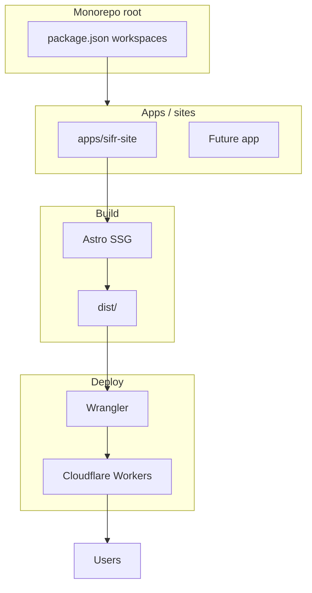

# Sifr Blog and Website on Cloudflare Workers (Monorepo)

## Scope

- **Monorepo**: This repo is a **monorepo**. The first app is the Sifr marketing website + blog (what we’re building now). Additional sites or apps (e.g. docs, playground, other Workers) can be added later as separate packages.
- **First app**: One Astro app that serves the “website” (homepage) and the “blog” (blog page), deployed to Cloudflare Workers per [Astro on Cloudflare Workers](https://developers.cloudflare.com/workers/framework-guides/web-apps/astro/).
- **Domain**: The site is served at **sifr.sh** (custom domain configured in Cloudflare for this Worker).
- **Cloudflare tooling**: Use the **Wrangler CLI** for all Cloudflare operations — local dev (`wrangler dev`), build, and deploy (`wrangler deploy`). No dashboard-only workflows for routine dev/deploy.
- **Pages**: Homepage (`/`) and Blog (`/blog`). No individual post routes for now.
- **Stack**: Astro (static or SSG), Cloudflare Workers (static assets first; `@astrojs/cloudflare` + SSR later if needed).
- **Logo**: Use [logo.webp](https://github.com/yaseralnajjar/sifr/blob/main/logo.webp) from the Sifr repo — place a copy in the first app’s `public/` so it is served as a static asset.
- **Theme**: Light only; no dark mode.
- **Tone**: Senior UI/UX — clear hierarchy, readable typography, generous spacing, accessible contrast, semantic HTML.

---

## Architecture




- **Root**: Single repo with a **workspaces**-based layout (e.g. `packages/`* and/or `apps/`*). Root `package.json` defines workspaces and may include shared scripts (e.g. `build:site`, `deploy:site`). Each site/app is its own package with its own `package.json`, build, and deploy config.
- **First app** (e.g. `apps/sifr-site`): Astro project for the main Sifr site + blog. Static-first: pre-render homepage and blog; **Wrangler CLI** serves that app’s `./dist` as [static assets](https://developers.cloudflare.com/workers/static-assets/) when deploying; no `main` in that app’s `wrangler.jsonc`. Local dev uses `wrangler dev` (or Astro’s dev server with Wrangler-compatible output). Later you can add `@astrojs/cloudflare`, SSR, and `main` per [Astro SSR + Workers](https://developers.cloudflare.com/workers/framework-guides/web-apps/astro/#if-your-site-uses-on-demand-rendering).
- **Custom domain**: **sifr.sh** is attached to this Worker (via Cloudflare dashboard: Workers & Pages → the worker → Domains & Routes → Add custom domain, or via `routes` in `wrangler.jsonc` if the domain is on the same Cloudflare account).
- **Future parts**: New sites or Workers go in new workspace packages (e.g. `apps/docs`, `apps/playground`). Each has its own framework and Wrangler config; shared tooling (lint, format) can live at root or in a shared package.

---

## Project layout (monorepo)

```
sifr-blog-website/                 # Repo root
  package.json                     # Workspaces: e.g. "apps/*"
  README.md
  .gitignore
  apps/
    sifr-site/                     # First app: marketing site + blog
      public/
        logo.webp                  # Copy from sifr repo or add here
      src/
        components/
          Header.astro
          Layout.astro
        pages/
          index.astro
          blog/
            index.astro
        styles/
          global.css
      astro.config.mjs
      package.json
      wrangler.jsonc
  # Future: apps/docs, apps/playground, packages/shared-*, etc.
```

---

## Implementation details

### 1. Bootstrap monorepo and first app

- **Root**: Create root `package.json` with `"private": true` and `"workspaces": ["apps/*"]` (or `["packages/*", "apps/*"]` if you plan shared packages). Optionally add root scripts that delegate to the app, e.g. `"build:site": "npm run build -w apps/sifr-site"`, `"deploy:site": "npm run deploy -w apps/sifr-site"`, `"dev:site": "npm run dev -w apps/sifr-site"`.
- **First app**: Create `apps/sifr-site/` and bootstrap Astro there (e.g. `cd apps/sifr-site && npm create cloudflare@latest . --framework=astro`, or create Astro manually and add Wrangler config). Prefer **static output**: no adapter, `astro build` → `dist/` with HTML/CSS/JS. Use **Wrangler CLI** for local dev and deploy: `npx wrangler dev` and `npx wrangler deploy` from the app directory (or via npm scripts that call wrangler).
- **App Wrangler config**: In `apps/sifr-site/wrangler.jsonc`, set `name` (e.g. `sifr-site`), `compatibility_date`, and `assets: { "directory": "./dist" }`. Omit `main` so only static assets are deployed. Add the custom domain **sifr.sh** via the Cloudflare dashboard (Workers & Pages → Domains & Routes) or, if the domain is on Cloudflare, via a `routes` (or Pages custom domain) configuration so the Worker is served at sifr.sh.

### 2. Logo and global layout

- Put `logo.webp` in `public/`. Reference it in layout/header as `/logo.webp`.
- **Layout.astro**: Single shared shell; viewport meta, title block, link to `global.css`; light background (e.g. off-white or white), dark text; include `<Header />` and a simple footer (e.g. “Sifr — Python syntax, Rust performance” + link to GitHub).
- **Header.astro**: Logo (link to `/`), primary nav: “Home”, “Blog” (`/blog`). Use a semantic `<header>` and `<nav>`; keep layout simple (e.g. horizontal flex), no hamburger for two links.

### 3. Homepage (`src/pages/index.astro`)

- Hero: Sifr logo, one-line tagline (e.g. “Python syntax. Rust performance.” from the [sifr repo](https://github.com/yaseralnajjar/sifr)), short supporting line.
- One clear CTA (e.g. “Get started” → GitHub repo or docs) and optional “Read the blog” → `/blog`.
- No heavy sections; generous padding and a single column for readability. Use semantic `<main>`, `<section>`, and heading hierarchy.

### 4. Blog page (`src/pages/blog/index.astro`)

- Title: “Blog” (or “Sifr blog”).
- For now, a static list is enough: e.g. “Coming soon” or 1–2 placeholder entries (title + short excerpt + optional “Read more” that goes nowhere). No dynamic `[slug]` routes yet.
- Reuse the same `Layout` and light theme; same header/footer.

### 5. Light theme and UI/UX (senior-level)

- **Colors**: Light background (e.g. `#fafafa` or `#ffffff`), dark body text (e.g. `#1a1a1a`), one accent for links and CTA (e.g. a blue or green that passes WCAG AA on white).
- **Typography**: System font stack (e.g. `ui-sans-serif, system-ui, sans-serif`) or one web font; clear scale (e.g. one size for body, larger for headings, consistent line-height).
- **Spacing**: Consistent vertical rhythm and padding; avoid cramped blocks.
- **Contrast and a11y**: Ensure text/background and link colors meet AA; use `focus-visible` styles for keyboard users.
- **Semantics**: Correct heading order, `<main>`, `<nav>`, `<footer>`; alt text for the logo.

---

## Out of scope for this plan

- Dark theme, blog post detail pages (`/blog/[slug]`), RSS, or CMS.
- “Normal” Workers logic (e.g. custom API routes) — add later if needed; the site itself is the Worker-deployed static (or later SSR) app.

---

## Validation

- **Build**: From repo root run the site build (e.g. `npm run build:site` or `npm run build -w apps/sifr-site`), or from `apps/sifr-site` run `npm run build` then `npx wrangler deploy`.
- **Deploy**: Use Wrangler CLI from the app directory: `npx wrangler deploy` (or root script `npm run deploy:site`). Ensure the custom domain **sifr.sh** is attached to this Worker in the Cloudflare dashboard so the site is live at [https://sifr.sh](https://sifr.sh).
- **Verify**: Open [https://sifr.sh](https://sifr.sh): homepage shows logo and nav; Blog at [https://sifr.sh/blog](https://sifr.sh/blog) shows the blog listing; both pages share layout and light theme; logo and links work.

---

## Logo source

The [sifr repository](https://github.com/yaseralnajjar/sifr) has `logo.webp` at the repo root. Copy it into `apps/sifr-site/public/logo.webp` (e.g. manually or via a one-time copy step documented in README) so the Astro build can serve it.